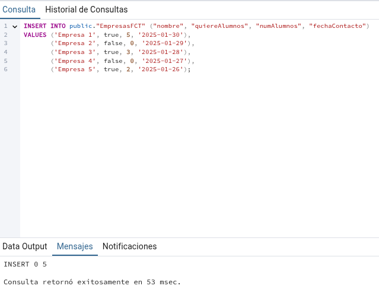
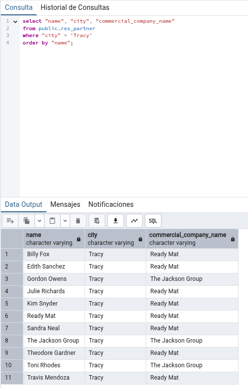
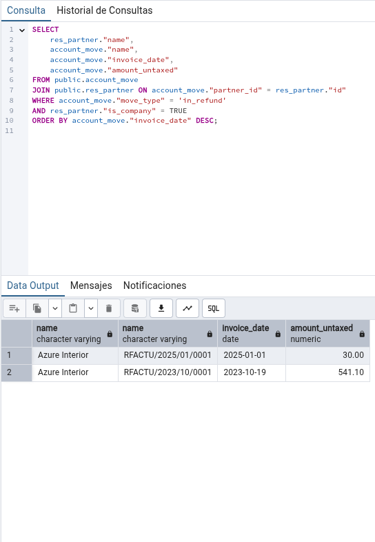

# Ejercicio 12 - Tarea BBDD

👤 **Autor:** Ana Valladares González

---

Primero, debemos crear una nueva base de datos para almacenar los datos con los que trabajaremos. Seleccionaremos la opción de instalar los datos de demo para que se cree una base de datos con datos de ejemplo.

## 1️⃣ Apartado 1

Aunque no es recomendable, en ocasiones puede ser necesario crear tablas ajenas a Odoo dentro de su base de datos (integración con sistemas externos, almacenamiento de históricos, datos temporales, etc.). Utilizando PgAdmin u otro método adecuado, elabora y ejecuta una sentencia que cree una tabla llamada `EmpresasFCT` con los siguientes campos:

- `idEmpresa`: autonumérico. Este campo será la clave primaria.
- `nombre`: texto con tamaño máximo de 40 caracteres.
- `quiereAlumnos`: booleano.
- `numAlumnos`: número entero.
- `fechaContacto`: tipo fecha.

```sql
CREATE TABLE IF NOT EXISTS public."EmpresasFCT"
(
    "idEmpresa" integer NOT NULL DEFAULT nextval('"EmpresasFCT_idEmpresa_seq"'::regclass),
    nombre character varying(40) COLLATE pg_catalog."default" NOT NULL,
    "quiereAlumnos" boolean NOT NULL,
    "numAlumnos" integer,
    "fechaContacto" date NOT NULL,
    CONSTRAINT "EmpresasFCT_pkey" PRIMARY KEY ("idEmpresa")
)

TABLESPACE pg_default;

ALTER TABLE IF EXISTS public."EmpresasFCT"
    OWNER to odoo;
```
***🖼️ Captura de pantalla:***


## 2️⃣ Apartado 2

Inserta 5 registros inventados en la tabla mediante una sentencia SQL.

```sql
INSERT INTO public."EmpresasFCT" ("nombre", "quiereAlumnos", "numAlumnos", "fechaContacto")
VALUES ('Empresa 1', true, 5, '2025-01-30'),
       ('Empresa 2', false, 0, '2025-01-29'),
       ('Empresa 3', true, 3, '2025-01-28'),
       ('Empresa 4', false, 0, '2025-01-27'),
       ('Empresa 5', true, 2, '2025-01-26');
```
***🖼️ Captura de pantalla:***
<p align="center">
  
  
</p>

## 3️⃣ Apartado 3

Realiza una consulta que muestre todos los datos de la tabla `EmpresasFCT` ordenados por `fechaContacto`, de modo que el registro con la fecha más reciente aparezca primero.

```sql
select * from public."EmpresasFCT" order by "fechaContacto" desc;
```
***🖼️ Captura de pantalla:***


## 4️⃣ Apartado 4

Realiza una consulta que obtenga un listado de todos los contactos de Odoo (no empresas) con la siguiente información:
- Nombre
- Ciudad: Tracy
- Nombre comercial de la empresa

Ordenados alfabéticamente por el nombre comercial de la empresa.

```sql
select "name", "city", "commercial_company_name" 
from public.res_partner 
where "city" = 'Tracy';
```
***🖼️ Captura de pantalla:***



## 5️⃣ Apartado 5

Utilizando las tablas de odoo, obtén un listado de empresas proveedoras, que han
emitido algún reembolso (facturas recticativas de proveedor)
- Nombre de la empresa
- Número de factura
- Fecha de la factura
- Total factura SIN impuestos
Ordenadas por fecha de factura de modo que la primera sea la más reciente.

```sql
SELECT DISTINCT ON ("invoice_partner_display_name") 
    "invoice_partner_display_name", 
    "name", 
    "invoice_date", 
    "amount_untaxed"
FROM public.account_move
WHERE "move_type" = 'out_refund'
ORDER BY "invoice_partner_display_name", "invoice_date" DESC;
```
***🖼️ Captura de pantalla:***



## 6️⃣ Apartado 6

Utilizando las tablas de odoo, obtén un listado de empresas clientes, a las que se les
ha emitido más de dos facturas de venta (solo venta) confirmadas, mostrando los
siguientes datos:
- Nombre de la empresa
- Número de facturas 
- Total facturado SIN IMPUESTOS

```sql
SELECT 
    "invoice_partner_display_name", 
    COUNT("id"), 
    SUM("amount_untaxed")
FROM public.account_move
WHERE "move_type" = 'out_invoice'  -- Solo facturas de venta
AND "state" = 'posted'  -- Solo facturas confirmadas
GROUP BY "invoice_partner_display_name"
HAVING COUNT("id") > 2  -- Empresas con más de 2 facturas
ORDER BY SUM("amount_untaxed") DESC;
```
***🖼️ Captura de pantalla:***


## 7️⃣ Apartado 7

Crea una sentencia que actualice el correo de los contactos cuyo dominio es @bilbao.example.com a @bilbao.bizkaia.eus

```sql
UPDATE public.res_partner
SET "email" = replace("email", '@bilbao.example.com', '@bilbao.bizkaia.eus')
WHERE "email" LIKE '%@bilbao.example.com';
```
***🖼️ Captura de pantalla:***


## 8️⃣ Apartado 8

La empresa Ready Mat ha hecho un ERE y ha despedido a todos los empleados
que tenías como contacto. Crea una sentencia que elimine todos los contactos
pertenecientes a la empresa “Ready Mat”, pero mantén la empresa. Añade una
captura de pantalla de la sección de contactos de odoo con Ready Mat antes y
después.

```sql
DELETE FROM public.res_partner
WHERE "company_id" IN (
    SELECT "id" FROM public.res_company WHERE "name" = 'Ready Mat'
)
AND "is_company" = FALSE;  -- Solo elimina contactos, no la empresa
```
***🖼️ Captura de pantalla:***

